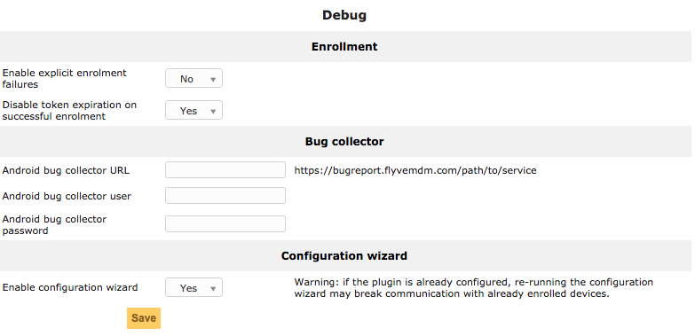

Debug
=====

* Enrollment:

  * Enable explicit enrollment failures: if enabled sends to devices the exact reason of an enrollment failure. For debug purposes only.
  * Disable token expiration on successful enrollment: the invitation token won't expire after succesful enrollment.

* Bug collector: 
  
  * Android bug collector URL: is the URL of a ACRA server. This server collects crash reports sent by Flyve MDM for Android.
  * Android bug collector user: username used by devices when they send a crash report.
  * Android bug collector password: password used by devices when they send a crash report.

* Configuration wizard: enables the wizard display.