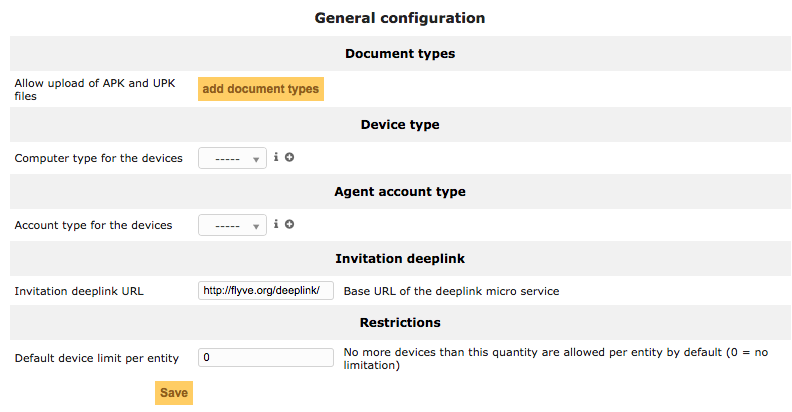

General
=======

* Document types: add the types .apk and .upk required to upload uhuru and android apps.
* Device type: type of the computer for the devices, it can be added a new type with the "+" button.
* Agent account type: category of the user, it can be added a new type with the "+" button.
* Invitation deeplink: base url for the deeplink micro service.
* Restrictions: limit the number of devices allowed per entity.