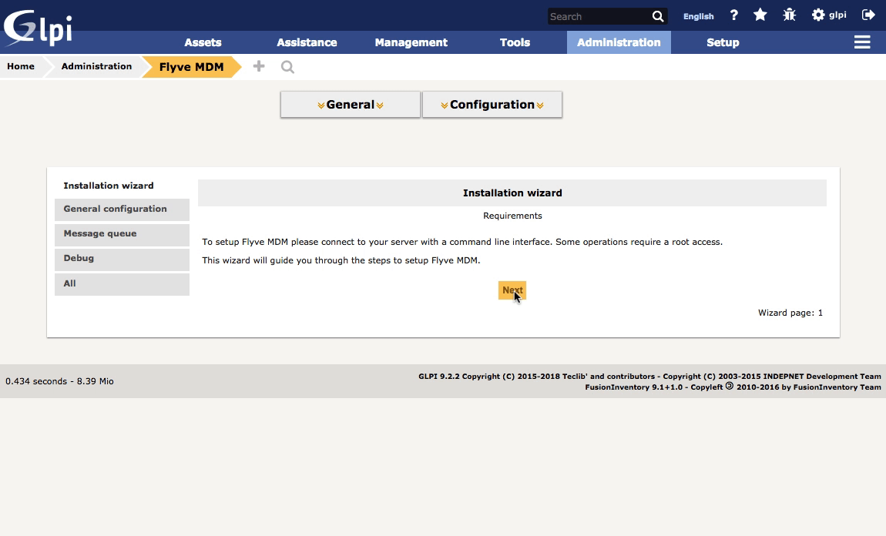

Configuration
=============

Flyve MDM counts with a Wizard to make sure everything is set up as it should, go to Flyve MDM configuration and select the tab Installation Wizard.

We believe the Administrator of the IT infrastructure must know every configuration that GLPI requires 
to work with Flyve MDM, therefore in the Wizard is an step by step guide to configure GLPI.

In case a step is missed or misconfigured in GLPI, a message will be shown in the plugin, warning you in order to avoid future problems.

Next, we'll be explaining every configuration tab of the plugin.

.. toctree::
   :maxdepth: 1

   general
   message-queue
   debug