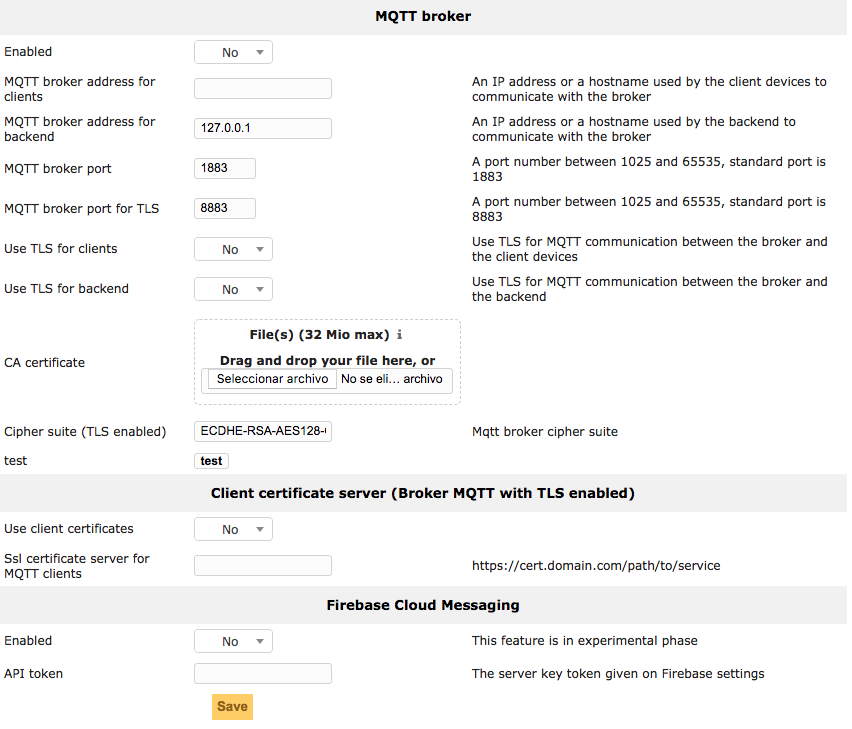

Message Queue
=============

* MQTT Broker:

  * MQTT broker address for clients: an IP address or a hostname used by the clients to communicate with the broker.
  * MQTT broker internal address for backend: an IP address or a hostname used by the backend to communicate with the broker.
  * MQTT broker port: a port number between 1025 and 65535, standard port is 1883.
  * MQTT broker port for TLS: a port number between 1025 and 65535, standard port is 8883.
  * Use TLS for clients: enables TLS communication between broker and clients.
  * Use TLS for backend: enables TLS communication between broker and backend.
  * CA certificate: is the certificate of an authority to verify the MQTT server.
  * Cipher suite is used to limit the ciphers used with TLS.

* Client certificate server (Broker MQTT with TLS Enabled)
  
  * Use client certificate: enables use of the client's certificate.
  * SSL certificate server for MQTT clients: url to the certificate server for MQTT clients.

* Firebase Cloud Messaging

  * Enable this feature to use FCM, for devices with Android 8 or later.
  * API Token: the server key, you can find it in your Firebase project settings > Cloud Messaging

.. important::
   After sending the certification request, the CA will very likely send back several files. 
   One is the certificate, signed by the CA, and the others are intermediate certificates.
   
   In Mosquitto **the certificate must be the concatenation of the certificate delivered + the intermediate certificates.**

   The operating system must contain more certificates to establish a trust chain to the root certificate.

.. important::
   The MQTT protocol and FCM can be enabled at the same time, to use FCM be sure to
   read `How to install the MDM Agent for Android 8 or later <http://flyve.org/android-mdm-agent/howtos/installation#android-later>`_.