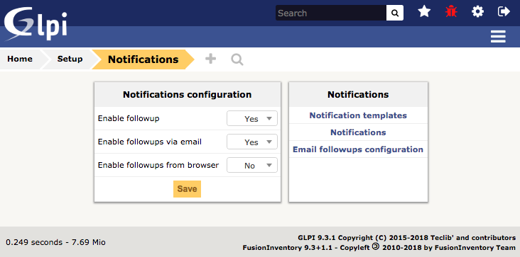
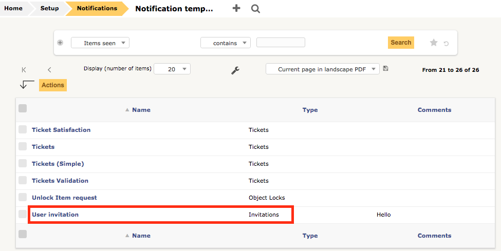
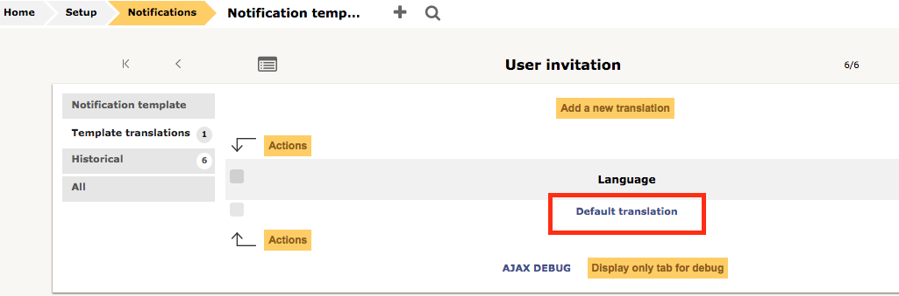
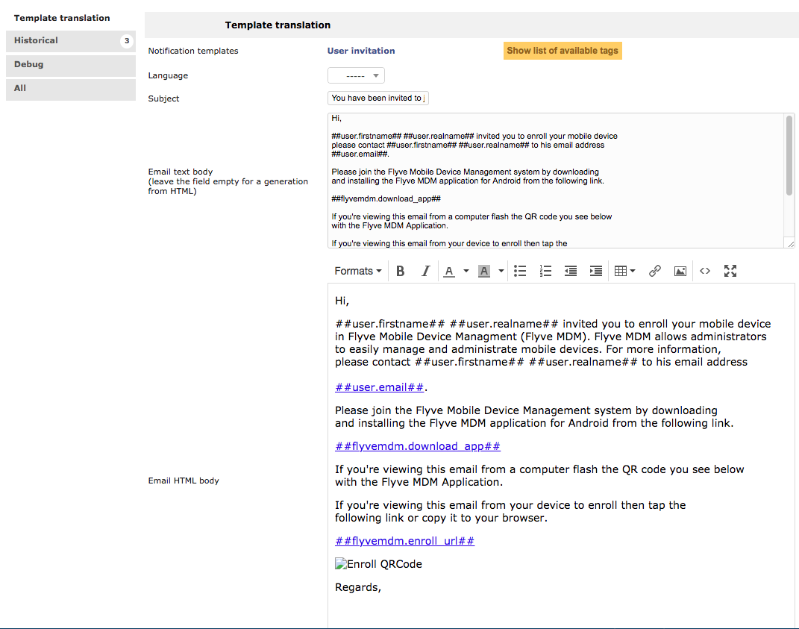

Customized Template
===================

If you want to modify the default template for the invitations, you can change it directly
from your GLPI instance.

1. Go to Setup > Notifications > Notifications Templates

2. Find the User Invitation template

3. Select Template translation > Default translation

4. Modify the email message according to your requirements

