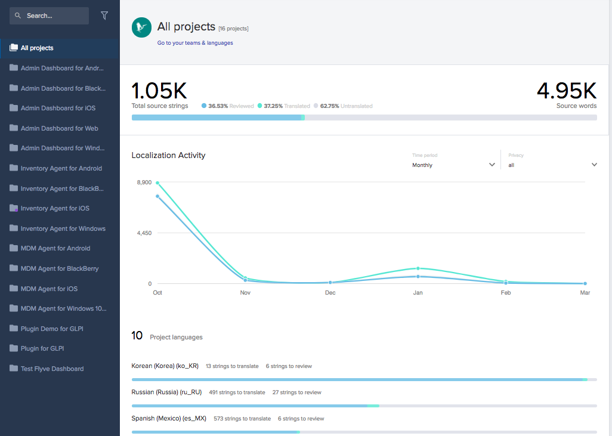
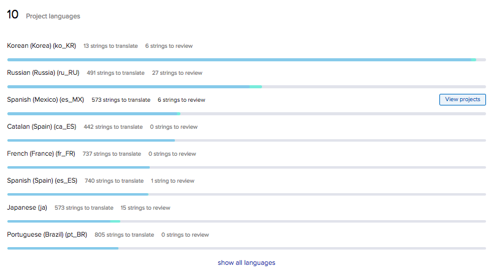
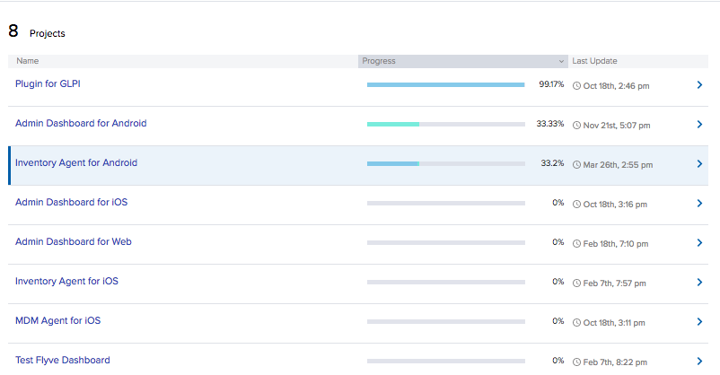
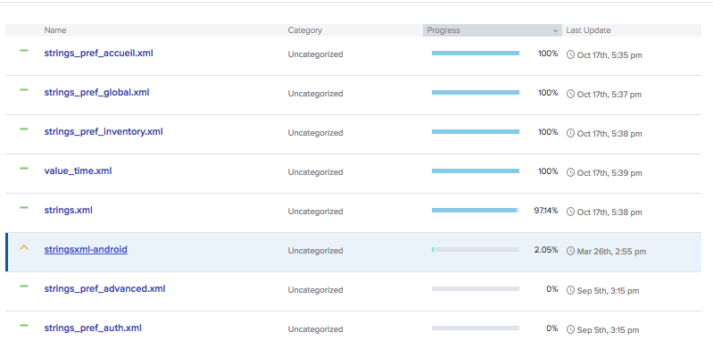
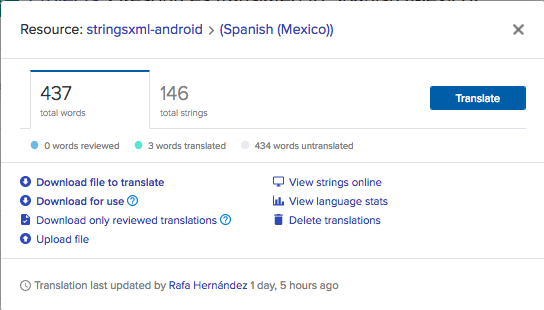
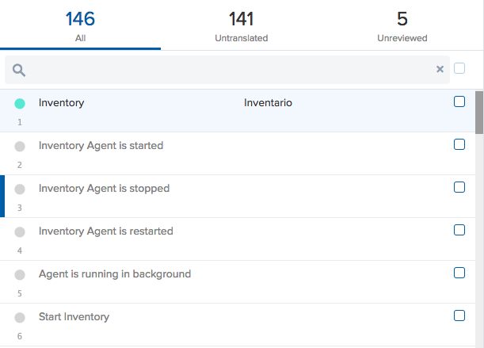
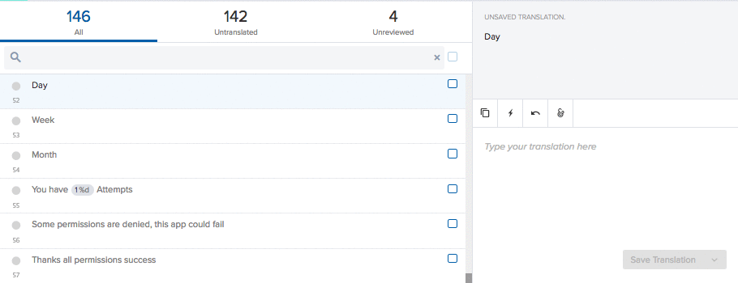

Translations
============

I know a lot of languages
-------------------------

Great! We are currently translating to Korean, Spanish, Catalan, French, Portuguese, Russian, Japanese and more.

But wait! I'm an expert in a different language
-----------------------------------------------

If you are an expert in a language we are not currently translating, you can request this translation in Transifex and help us to reach more customers in their native language.

Let's Translate
---------------

We use `Transifex <https://www.transifex.com/>`_ to translate our projects. To start contributing with `any of our projects' translations <https://www.transifex.com/flyve-mdm/public/>`_ you require an account and to request to join the team of Flyve MDM.

After you are accepted you can now go to the Flyve MDM organization where you'll see all the projects listed to your left and a graphic with the statistics of Source Strings translations.

Under the graphic you can see all the languages in which the projects are being translated to, select the one you will translate, and click on View Projects.

All the projects under translation in that language will be displayed, you will also be able to see how many strings are required to translate. Select a project.

A list with the files requiring translations will be displayed, click on one of them.

A modal window will appear, click on Translate.

You'll see all the words in the file, you can filter them by clicking on Untranslated.

Select the word to translate, in the box next to it, where indicated, add your translation, save the translation and you're done.

Thank you for your contribution!

For more information about Transifex checkout their `Help Center Documentation <https://docs.transifex.com/>`_.