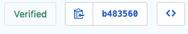

Join our community!
===================

Welcome to our awesome team!

We are more than happy to accept external contributions to the project in the form of feedback, translations, bug reports, and even better, pull requests!

Starting from the basics, here we'll be explaining everything you need to know to contribute in Flyve MDM plugin for GLPI.

Download & New Accounts
-----------------------

You'll require to install and open new accounts in the following:

* `Download Git <https://git-scm.com/downloads>`_
* `Download Visual Studio Code <https://code.visualstudio.com/#alt-downloads>`_
* `Download GPG command line tools <https://www.gnupg.org/download/>`_
* `Telegram account <https://telegram.org/>`_
* `GitHub account <https://github.com/>`_
* `Keybase Account <https://keybase.io/>`_

Set things up
-------------

Git
~~~

After installing git, run:

.. code::

    git config --global user.name "First.Name Last.Name"
    git config --global email "myemail@email.com"

.. tip::
   Git provides the `Pro Git book <https://git-scm.com/book/en/v2>`_, available in several languages, and `Try Git <https://try.github.io/levels/1/challenges/1>`_, a 15 min tutorial, both very helpful if you're starting with SCM.

GitHub
~~~~~~

For security reasons, we demand our members to have enabled the following Authentication measures. The instructions to configure each one are available from the GitHub Help Documentation, this assures us that any change added to any of our repositories comes from an authorized member of our team.

.. tip::
   We strongly recommend to configure your GitHub account and Git locally, if you are a collaborator, it will increase security to your account and work.

Two Factor Authentication
#########################

This is the easiest step, you only need to follow the GitHub Documentation, `Securing your account with 2FA <https://help.github.com/articles/securing-your-account-with-two-factor-authentication-2fa/>`_, there are several methods to do this, for example by `SMS Text <https://help.github.com/articles/configuring-two-factor-authentication-via-text-message/>`_ or a `TOTP app <https://help.github.com/articles/configuring-two-factor-authentication-via-a-totp-mobile-app/>`_.

Test it!
$$$$$$$$

Sign out then sign in again, GitHub will ask you the Authentication code.

SSH
###

Follow the GitHub guide, `Connecting to GitHub with SSH <https://help.github.com/articles/connecting-to-github-with-ssh/>`_, there is everything you need to know to successfully add your SSH key.

Test it!
$$$$$$$$

1. `Create a Test Repository on GitHub <https://help.github.com/articles/create-a-repo/>`_

2. Create a ``test`` directory on your work environment

3. From the terminal go to your ``test`` directory and run:

   ``git clone git@github.com:MY-USER-NAME/MY-REPO-NAME.git``

4. Run ``ls -a`` to list all directories in test/

If there is a new folder with your repo name, then the setup of SSH was successful!

GPG signing
###########

This configuration requires some patience.

1. Go to your Keybase account and generate a new GPG key.
2. Sign in from a browser to your Keybase Account.
3. Click on the ID of your PGP key.
4. Copy everything between:

.. code::

    -----BEGIN PGP PUBLIC KEY BLOCK-----
    -----END PGP PUBLIC KEY BLOCK-----

5. Paste it on your GitHub settings
   Go to settings > SSH and GPG keys > New GPG key
6. Import your private key to your PC:

   6.1. Go to your keybase account on your browser

   6.2. Next to your key ID, click on edit and select export private key

      .. image:: images/export-private-key.png
         :alt: Export private key from keybase

   6.3. Copy and paste your private key in a txt editor, and save it with the name ```private.key```

       * On Windows make sure it is on your user folder.

   6.4. Go to command line and run:

      ``gpg --import private.key``

   6.5. Check the key was imported by running:

      ``gpg --list-secret-keys --keyid-format LONG``

   Here should be listed your key, check the ID from keybase is the same on the sec line.

   .. image:: images/check-key-id-terminal.png
      :alt: Key ID on terminal

   .. image:: images/check-key-id.png
      :alt: Key ID on keybase

7. Tell git about your GPG key, run:

``git config --global user.signingkey B344E73DA95715F4``

Also run the following commands to sign all commits by default:

``git config --global commit.gpgsign true``

``git config --global gpg.program "C:\Program Files (x86)\GnuPG\bin\gpg.exe"`` 

Test it!
$$$$$$$$

1. With your Visual Studio Code open the folder of your cloned repo
2. Open the Readme and add a new line to it, for example: ``Hello World``
3. Save changes and open the terminal on VS Code:

  * On Windows use: ``ctrl + ñ``

  * On OSX use: ⌃`

4. Run: ``git add . && git commit -s -m "my first commit" && git push``
5. Now go to your repo and click on commits, you should see the Verified label.



* Git explanation:

  * ``git add .`` -> Adds the changes to be committed

  * ``git commit -s -m "message"`` -> commits the changes, -s is for signing the commit and -m "message", the message describing the changes

  * ``git push`` -> pushes the local changes to your remote repo (the repo on GitHub)

.. tip::
   Don't forget you can learn more about these git commands with the `Pro Git book <https://git-scm.com/book/en/v2>`_, available in several languages, available in several languages, and `Try Git <https://try.github.io/levels/1/challenges/1>`_, tutorial.

Now that everything is set up
-----------------------------

From the `Contributing Guidelines <https://github.com/flyve-mdm/glpi-plugin/blob/develop/CONTRIBUTING.md>`_ you'll learn how to make an issue, a PR with your contribution, using the `Git Flow <http://git-flow.readthedocs.io/en/latest/>`_, `Conventional Commits <http://conventionalcommits.org/>`_ and the tools we implement.

.. attention::
   The guidelines are mandatory for Contributors, Maintainers and Collaborators.

Inside our repos
----------------

Branches
~~~~~~~~

We use the `git flow branching model <http://nvie.com/posts/a-successful-git-branching-model/>`_.

We have three main branches in every repository, each one has a specific function:

* Our ``master`` branch is for the Long Term Support version.
* The ``develop`` branch is for our Bleeding edge version, and finally
* The ``gh-pages`` branch, where the project site is build using `Jekyll <https://jekyllrb.com/>`_.

Continuos Integration
~~~~~~~~~~~~~~~~~~~~~

To speed things up and as part of our quality control, we count with automatic processes to run tests for the Pull Requests in our projects and to generate/update the information in the Development section on our gh-pages branches.

Merges in ``Develop branch``
############################

Every time a merge is made in develop the following documentation is generated or updated.

* Code Documentation: the description of every class and function of the source code.
* Coverage: the coverage of the code according to the tests.
* Test Report: the report thrown after all the tests are run.

Merges in ``Master branch``
###########################

But when the merge is in master:

* Changelog: the list of commits that either add a fix or a feture, since the last stable version released.
* Releases: create a GitHub release.


.. important ::
   * We follow the `Standard version <https://github.com/conventional-changelog/standard-version>`_ for changelogs and the `Semantic versioning <https://semver.org/>`_ for the releases.
   * According to the projects they might have other deployment tasks besides the ones previously described, you should read the README.md in every ``ci`` directory to know their specific workflow.
