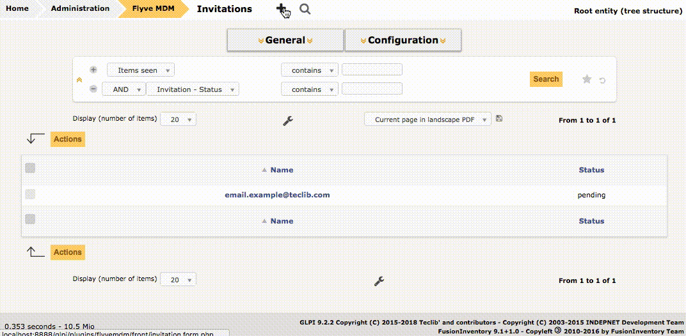
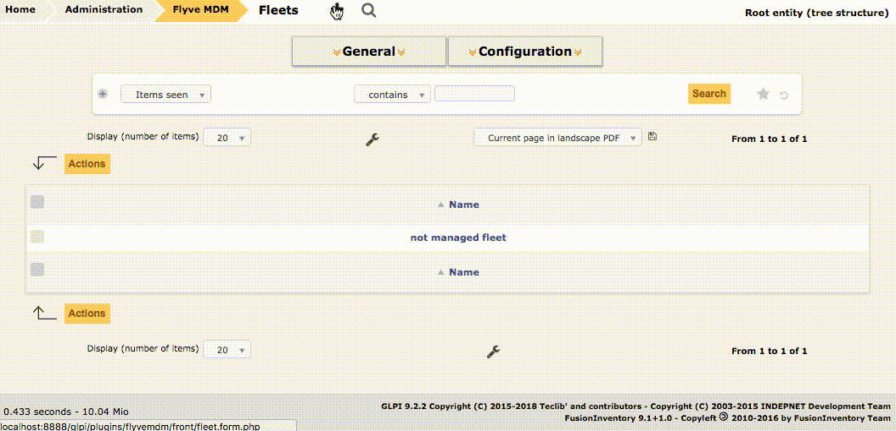
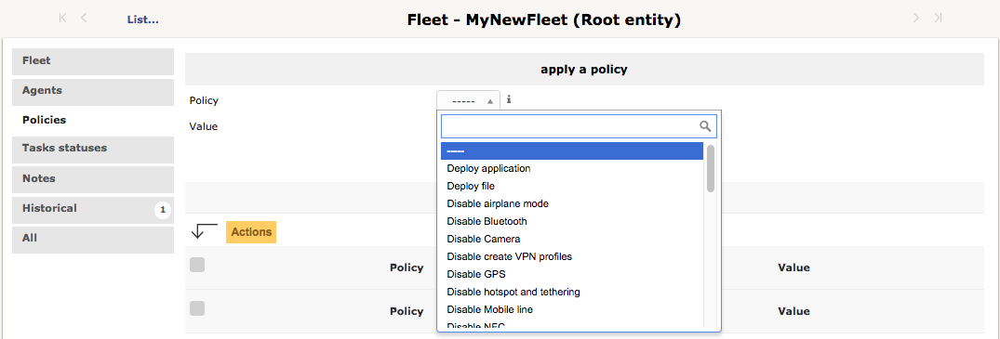
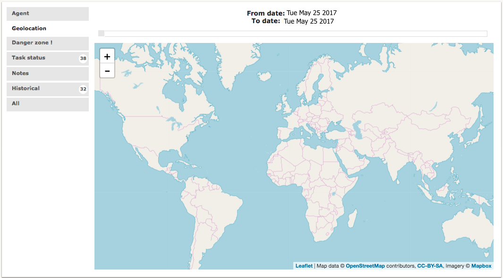
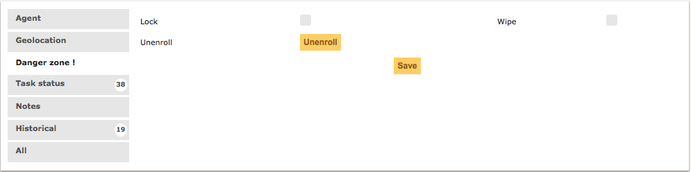
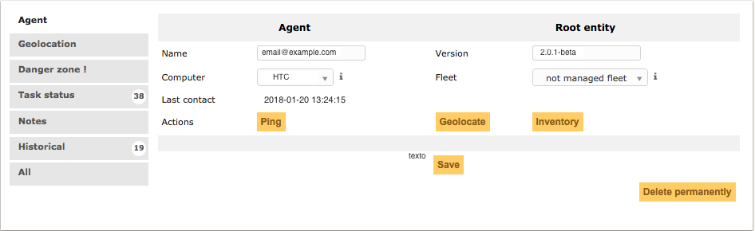

Getting Started
===============

The Flyve MDM plugin for GLPI integrates the intuitive and outstanding features of Flyve MDM into GLPI platform providing you the security functionality for your IT infrastructure.

As GLPI is a Free Asset and IT Management Software package, we wanted to provide a plugin that helps you to keep control of your mobile devices, here we'll guide you in the steps to manage your mobile fleet from the basics.

Enrolling Agents
----------------

In order to add the devices to your fleet, you must invite the owner of the device to enroll by sending him an email.

* Go to the Invitations section
* Click on the "+" button
* Write the email of the user whose device you'll control
* Click on Add

The invitation will have the status pending until the user enrolls the device.

.. note::

   Users must have installed in their devices the Android or iOS Agent, see these links for more information:

    * `Android MDM Agent - Getting started <http://flyve.org/android-mdm-agent/howtos/getting-started>`_.
    * `iOS MDM Agent - Getting started <http://flyve.org/ios-mdm-agent/howtos/getting-started>`_.

After enrollment, the device will be displayed on the Agent section.

Create your Fleet
-----------------

You must create a new fleet since the "not managed fleet" is the default one and therefore comes locked.

.. warning::
   Carefull, be sure to not delete it since it will bring you some problems.

In order to create it, you only have to follow these steps:

* Click in the "+" button on the Fleet section
* Name it and Click on add.

When you return to the Fleet section, you'll see your created fleet listed.

Add Policies
~~~~~~~~~~~~

To add the policies:

* Go to the Fleets section 
* Select your Fleet by clicking on it
* Select the Policies tab

There you can add all the policies your fleet requires.

Once you assign the devices to the Fleet, all the policies will be immediately applied!

Assign the Agent to a Fleet
~~~~~~~~~~~~~~~~~~~~~~~~~~~

For this you must go to the Agent section

* Select the Agent
* In the Fleet option, select your fleet
* Click on save

.. image :: images/assign-fleet.png
   :alt: Assign a fleet

.. note ::
   An Agent can be assigned to only one Fleet.

Adding Files & Applications
---------------------------

You must add in their respective sections the Files and Packages so you can deploy them on your Fleet. 

.. note ::
   You must have previously added the APK and UPK types.

* Go to the Files section
* Click on the "+" button
* Name and select your file
* Click on Add

.. image :: images/file.gif
   :alt: Adding files

Now it will be available when you use the Deploy file policy.

.. image :: images/file-added.png
   :alt: File deployment

The same procedure applies to the applications.

* Go to the Package section
* Click on the "+" button
* Name and select your application
* Click on Add

.. image :: images/app.gif
   :alt: Adding Applications

Now it will be available when you use the Deploy application policy.

.. image :: images/app-added.png 
   :alt: Apps deployment

Our Policies
------------

The policies selected are sent in a JSON file to the MDM Agent with the values specified.

If the MDM Agent does not have the system privileges, it will require the confirmation of the user to implement the policies.

.. note::

   Some policies are not available according to the version - API Level, for more information you can check the `Compatibility Matrix <http://flyve.org/android-mdm-agent/howtos/policies>`_

Disable
~~~~~~~

* Bluetooth: allows/forbids the use of Bluetooth.
  
   Values: Yes or No.
* Airplane mode: allows/forbids the use of the airplane mode.

   Values: Yes or No.
* Camera: allows/forbids the use of any camera on the phone.

   Values: Yes or No.
* Create VPN profiles: allows/forbids the use to create VPN profiles. Available for devices with Api equal to or greater than 25.

   Values: Yes or No.
* GPS: allows/forbids the use of the GPS.

   Values: Yes or No.
* Hotspot and tethering: allows/forbids to configure the device as hotspot or tethering.

   Values: Yes or No.
* Mobile line: allows/forbids the user to use the mobile line.

   Values: Yes or No.
* NFC: allows/forbids the use of the Near Field Communication.

   Values: Yes or No.  
* Roaming: allows/forbids the use of Roaming. Available for devices with Api equal to or greater than 21.

   Values: Yes or No.
* Screen capture: allows/forbids the user to make a screen capture. Available for devices with Api equal to or greater than 21.

   Values: Yes or No.
* SMS and MMS: allows/forbids the user to send SMS and MMS.

   Values: Yes or No.
* Speakerphone: allows/forbids the user to use speakerphone.

   Values: Yes or No.
* Status bar: allows/forbids the user to use the status bar.

   Values: Yes or No.
* USB ADB: allows/forbids the user to use the Android Debug Bridge through USB.

   Values: Yes or No.
* USB MTP: allows/forbids the user to use the Media Transfer Protocol through USB.

   Values: Yes or No.
* USB PTP: allows/forbids the use of the Picture Transfer Protocol through USB.

   Values: Yes or No.
* Wifi: allows/forbids the user to connect to Wifi.

   Values: Yes or No.
* Unknown sources: allows/forbids the installation of apps from unknown soureces.
 
   Values: Yes or No

Password
~~~~~~~~

* Maximum failed password attempts for wipe: sets the number of failed attempts to unlock the device before wiping it.

   Value: number of failed attempts.
* Maximum time to lock: the time in milisecond before to lock the device.

   Values: number of miliseconds.
* Minimum letters required in password: minimum number of letters required.

   Values: number of letters.
* Minimum lowercase letters required in password: minimum number of lowercase letters required.

   Values: number of lowercase letters.
* Minimum non-letter characters required in password: minimum number of non-letter characters required.

   Values: number of non-letter character.
* Minimum numerical digits required in password: minimum number of digits required.

   Values: number of digits.
* Minimum password length: minimum length.

   Values: number of minimun length.
* Minimum symbols required in password: minimum number of symbols required (@, %, =, &, \*, etc).

   Values: number of symbols.
* Minimum uppercase letters required in password: minimum uppercase letters.

   Values: number of uppercase letters.
* Password enabled: enables/disables the password, if enabled it will request the password creation.

   Values: Yes or No.
* Password quality: sets the complexity of the password.

   Values:

   * Unspecified: no complexity specified.
   * Something: requires a password but without a specific requirement.
   * Numeric: numbers only.
   * Alphabetic: letters or other symbols.
   * Alphanumeric: numbers and letters.
   * Complex: a combination of numbers, letters and symbols.
* Reset password: if a pasword is forgotten, it resets it to a new value.

   Values: the new password (string).

Encryption
~~~~~~~~~~

* Internal Storage encryption: encrypts the internal storage of the device.

   Values: Yes or No.
* Use TLS: allows/forbids to use TLS protocol.

   Values: Yes or No.

Apps & Files
~~~~~~~~~~~~

.. warning::

   To deploy a file or application, they must be previously uploaded to their respective sections.

* Deploy application: installs the application.

   Value: The application.

    Remove: if set to Yes, when the policy is removed, it will also remove the app by adding Remove application policy.

* Deploy file: downloads a file.

   Values: the file.

    Copy to: specifies the path where the file will be downloaded.

    Remove: if set to Yes, when the policy is removed, it will also remove the file by adding Remove file policy.

* Remove application: uninstalls an application.

   Value: the id of the APK.

    Example: ``com.remove.app``.

* Remove file: removes a file from the device.

   Value: the name of the file with its format.

    Example: myfile.jpg

.. note::

   The Apps & Files policies can be used as many times as the Administrator requires.

Inventory
~~~~~~~~~

* Set an inventory frequency: set the frequency in which will be run the inventory.

   Values: number of minutes.

Features
--------

These are particular actions that can be taken only from the Agent section, some are accessible from the Agent tab and others from the Danger Zone! tab.

Ping
~~~~
 
Allows to check the connectivity with the device.

Geolocate
~~~~~~~~~

Geolocates the device and shows its location on the map.

Inventory
~~~~~~~~~

Get the current inventory of the device.

Lock
~~~~

If enabled, it will lock the device.

Wipe
~~~~

Erase all the information in the device.

.. warning::

   After wipe there is no going back.

Unenrolling Agents
------------------

The Unenrollment will leave the device at the current state, this means the Flyve MDM Agent won't be uninstalled from the device, however the policies will be unapplied.

* Go to the Agent's section
* Select the Agent to Unenroll
* Select the tab Danger Zone! 
* Click on Unenroll.

.. note::
   To uninstall the App you must go to Security > Device Administrator and uncheck Flyve MDM first.

Delete an Agent
---------------

Deleting the agent will make all the policies unapplied.

* Go to the Agent's section 
* Select the Agent to delete
* Select the tab Agent
* Click on Delete permanently.

.. important::
   Apps & Files already deployed won't be removed after deleting or unenrolling an Agent.

.. warning::
   When deleting or unenrolling the Agent, you can't go back. You will have to re-enroll the device again.