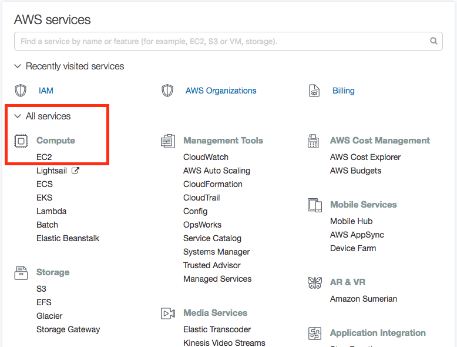
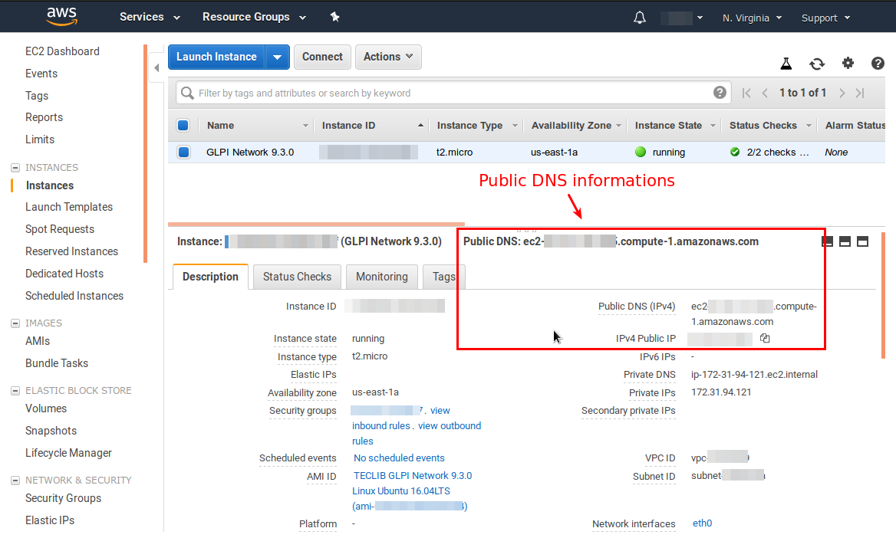
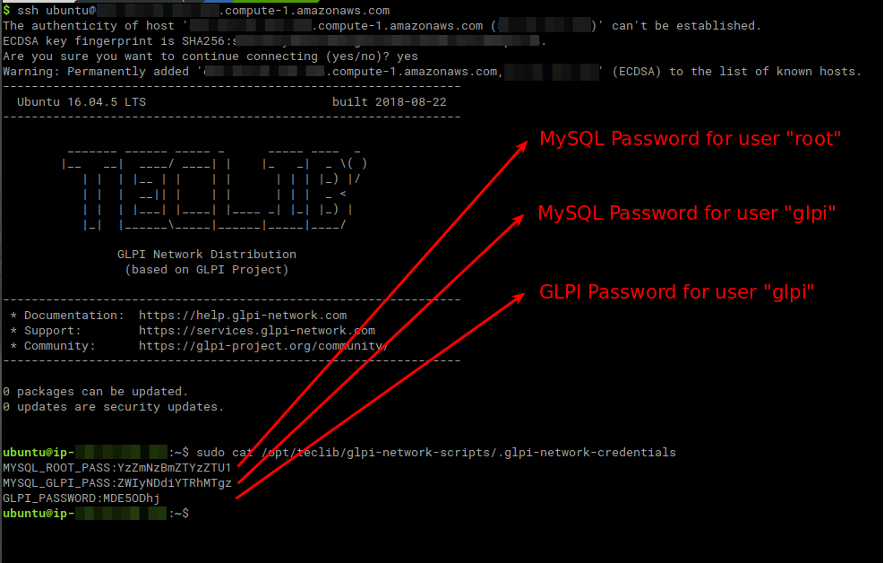
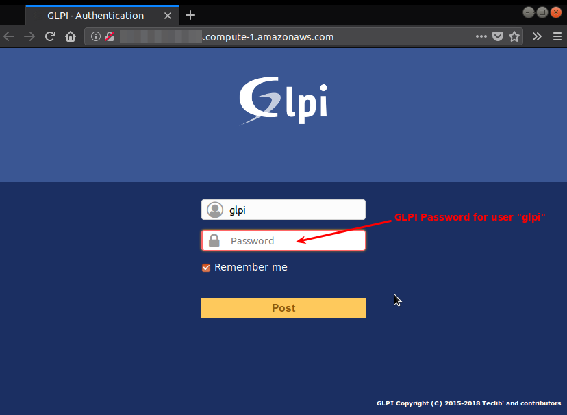

Amazon Web Services
===================

Amazon Web Services is a cloud services platform that offers a wide range of functionality to business, providing computing resources to host from simple web pages to more elaborated applications, data storage and more.

To start using GLPI Network from the AWS, follow these steps to create your account and launch the instance.

1. Create an account
--------------------

1. Go to `Amazon Web Services <https://aws.amazon.com/>`_.
2. Click on create account, it will redirect you to another page, click again on create a new account.
3. Fill your information

  3.1 Email, password

    .. image:: images/create-aws-account.png
       :alt: Contact Information

  3.2 Contact information

    .. image:: images/contact-information.png
       :alt: Contact Information

  3.3 Payment information

    .. image:: images/payment-information.png
       :alt: Payment Information

  .. note::
     If you create an account for the first time, you'll have 12 months of Free Tier Access. No 
     charges will be made to your credit or debit cards as long as you don't pass 
     the limits of the `AWS free tier <https://aws.amazon.com/free/>`_.

4. Account verification, you'll receive a phone call asking you to introduce a code through your phone's keypad.
5. Choose a support plan. For more information, see the `Compare AWS Plan Support <https://aws.amazon.com/premiumsupport/compare-plans/>`_.
6. Once your account has been activated you'll receive a confirmation email, after this you'll have full access to the Amazon Web Services.

2. Create a Key pair
--------------------

To access and launch EC2 instances, you'll need a SSH key. 

.. attention::
   Save it in a safe place! This key will be displayed to you only once, and it's required
   to connect to AWS servers and EC2 Linux instances, which means your GLPI.

1. Sign in to your AWS account, go to `Amazon Web Services <https://aws.amazon.com/>`_
2. After signing in, you'll be redirected to your `AWS console <https://docs.aws.amazon.com/awsconsolehelpdocs/latest/gsg/getting-started.html>`_.
3. Display all services and select the EC2 service.

4. Under Network & Security, select Key pairs
5. Click on Create Key Pair
6. You'll be prompted for a name
7. A public and private key will be generated, download the private key, remember to **save it in a safe place**.

3. Deploy GLPI
--------------

1. Sign in to your AWS Marketplace account (the same credentials of your AWS account), go to `AWS Marketplace <https://aws.amazon.com/marketplace/>`_
2. Search GLPI Network, provided by Teclib', there you'll be able to view the product overview, pricing, usage, support and reviews.
3. Click on Continue to Subscribe.

    .. image:: images/GLPI-network-basic.png
       :alt: Continue to subscribe

4. You'll be able to review and accept the Terms and conditions along with the pricing information.
5. After accepting the Terms and subscribing, click on Continue to configuration.
6. Review the configuration of the instance, make sure the SSH key pair is the same as the one you created previously, click on Launch.
7. After your GLPI instance has been launched on the server, it'll have a public DNS. You can retrieve it from the EC2 Dashboard.

8. Connect through SSH, for this you'll need the username "ubuntu" and the public DNS:

.. code::

   ssh ubuntu@ec2-XXX-XX-XXX-X.compute-1.amazonaws.com

Type yes when asked to continue connecting.

9. Use the following command to retrieve the login credentials.

.. code::

   sudo cat /opt/teclib/glpi-network-scripts/.glpi-network-credentials

.. attention::
   We strongly recommend that you retrieve and record this information 
   outside the deployed instance and then delete the file.

10. Access the application via web browser at ``http://<EC2_Instance_Public_DNS>``

11. Log in with the username “glpi” account and the password you retrieved in step 9

.. note::
   For more information you can also check the `AWS Documentation regarding EC2 <https://docs.aws.amazon.com/ec2/index.html?id=docs_gateway#lang/en_us>`_