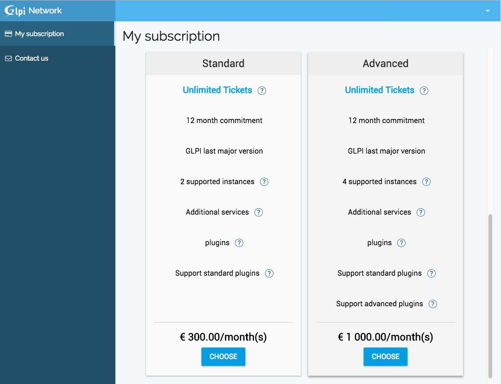
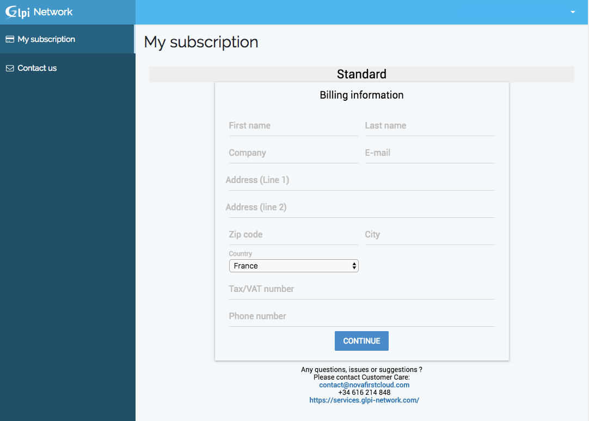
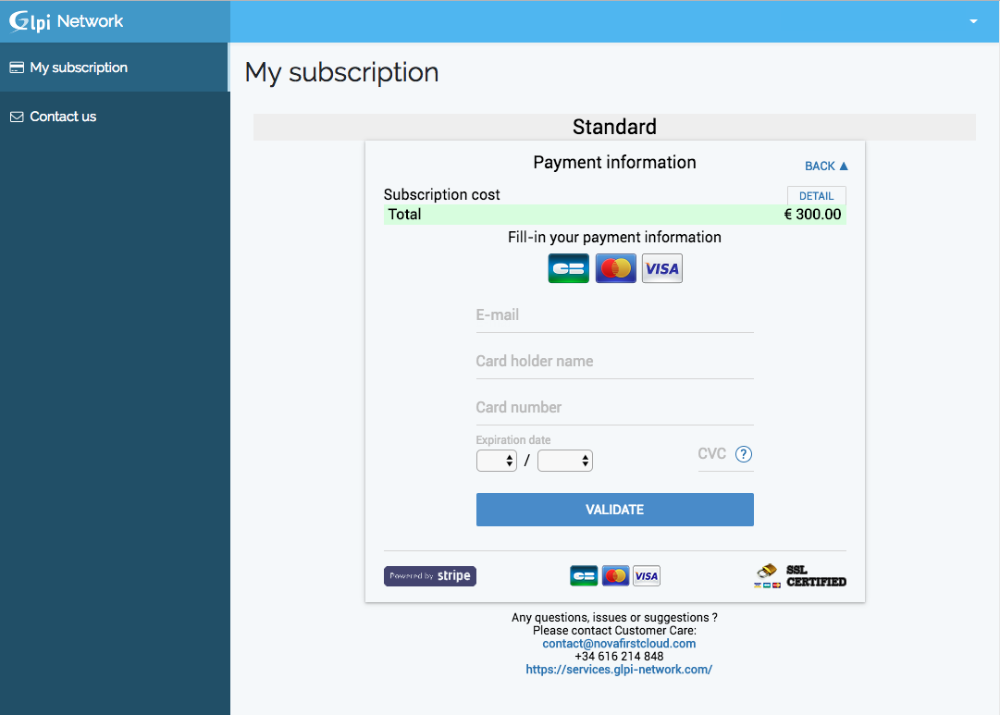

Cloud Services
==============

GLPI Network
------------

GLPI Network is a subscription service for companies and organizations, it includes support from the developers
and access to the local partners in your own language.

You'll have access to exclusive benefits such as new features request, additional services and plugin support according to your subscription.

1. Register
-----------

1. Go to `GLPI Network Register form <https://services.glpi-network.com/register>`_
2. Fill your information:

    2.1 Name, Email, Password

    .. image:: images/register.png
       :alt: Register form

3. Click on My subscription, choose the Standard plan which brings you Flyve MDM

4. Fill your billing information, then click on Continue

5. Fill your payment information, then click on Validate

**Welcome to Flyve MDM, you're now subscribed!**

Now you can create tickets to get support.